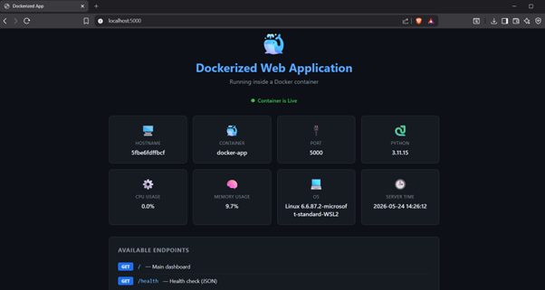

# 🐳 Basic Dockerized Application Deployment

## Preview


A simple web application built with **Flask** and containerized using **Docker** with port mapping for local deployment.

---

## 📋 Features

- ✅ Flask web app served inside a Docker container
- ✅ Port mapping — access the app at `http://localhost:5000`
- ✅ Live system stats (CPU, memory, hostname) from inside the container
- ✅ Health check endpoint at `/health`
- ✅ Docker Compose support for easy startup
- ✅ Automatic container restart policy

---

## 📁 Project Structure

```
docker-app/
├── app.py                 # Flask web application
├── Dockerfile             # Docker image instructions
├── docker-compose.yml     # Multi-container configuration
├── requirements.txt       # Python dependencies
├── .dockerignore          # Files excluded from Docker image
├── .gitignore
├── templates/
│   └── index.html         # Web UI
└── static/
    └── style.css          # Styling
```

---

## 🚀 Getting Started

### Prerequisites
- [Docker Desktop](https://www.docker.com/products/docker-desktop/) installed and running

### Option 1 — Docker Compose (recommended)
```bash
docker-compose up --build
```

### Option 2 — Docker commands manually
```bash
# Build the image
docker build -t docker-app .

# Run the container with port mapping
docker run -d -p 5000:5000 --name docker-app docker-app
```

### Open in browser
```
http://localhost:5000
```

---

## 🔌 Port Mapping Explained

```
-p 5000:5000
    │      └── Container port (inside Docker)
    └───────── Host port (your machine)
```

You access `localhost:5000` on your machine → Docker forwards it to port `5000` inside the container.

---

## 🛠️ Useful Docker Commands

```bash
# View running containers
docker ps

# Stop the container
docker-compose down

# View container logs
docker logs docker-app

# Rebuild after changes
docker-compose up --build
```

---

## 📄 License

MIT License — free to use and modify.
